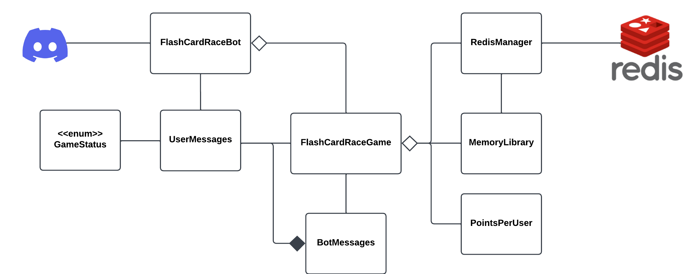

## Project Description

This bot is a flashcard race game where users can challenge each other to answer flashcard questions as quickly as 
possible. Players compete to see who can answer the most questions correctly until the game ends or terms run out. The bot tracks scores
and allows users to select categories for the flashcards. It can be played asynchronously, meaning users can
interact with the bot and challenge others.

## System Diagram

`FlashCardRaceBot:`\
Main class that integrates game logic, user interactions, and message handling into Discord.
Uses FlashCardRaceGame to manage the game, such as start/end game, add players, etc.
Uses user messages to receive user commands.

`GameStatus:`\
Defines different states of the game, NOT_STARTED, WAITING_FOR_PLAYERS, GAME_IN_PROGRESS, FINISHED.
Helps in ensuring actions performed are within the correct game state.

`UserMessages:`
Processes user messages and commands.
Uses FlashCardRaceGame to manage game actions based on user input.
Provides responses to user commands such as starting the game, joining the game, getting definitions, 
and adding points using BotMessages, as it depends on BotMessages for a response.

`BotMessages:`\
Provides predefined messages for various game states and user inputs.
Uses FlashCardRaceGame for certain messages when retrieving user data like users and points

`FlashCardRaceGame:`\
Manages the game logic, including starting and ending the game, adding players, and managing points.
Uses RedisManager to store and retrieve data from Redis, such as user points and current category.
Uses MemoryLibrary to get definitions and check if terms are correct.
Uses PointsPerUser to retrieve all user data

`PointsPerUser:`\
Manages the storage for the users and their points.
Gets/sets users and their data, provides their points, and clears all user data

`RedisManager:`\
Handles all interactions with the Redis database.
Provides methods to add players, add points, set/get current category, and clear data.
Stores user points, categories, and current definitions in Redis.

`MemoryLibrary:`\
Manages in-memory data, such as dictionaries of terms and definitions and list of categories.
Provides methods to get definitions and check if terms are correct.
Interacts with RedisManager to determine whether terms are correct and cycle through current definitions.

## Usage

Users can interact with the bot by sending commands to start the game, join the game, get definitions, add points, etc. 
The bot will respond with messages based on the game state and user input. The bot will track scores and allow users to select categories for the flashcards. It can be played asynchronously, meaning users
can interact with the bot and challenge others.
